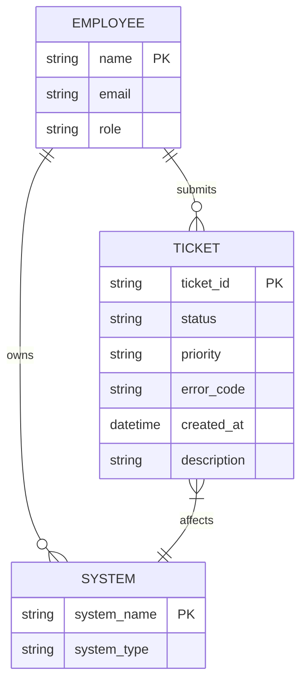
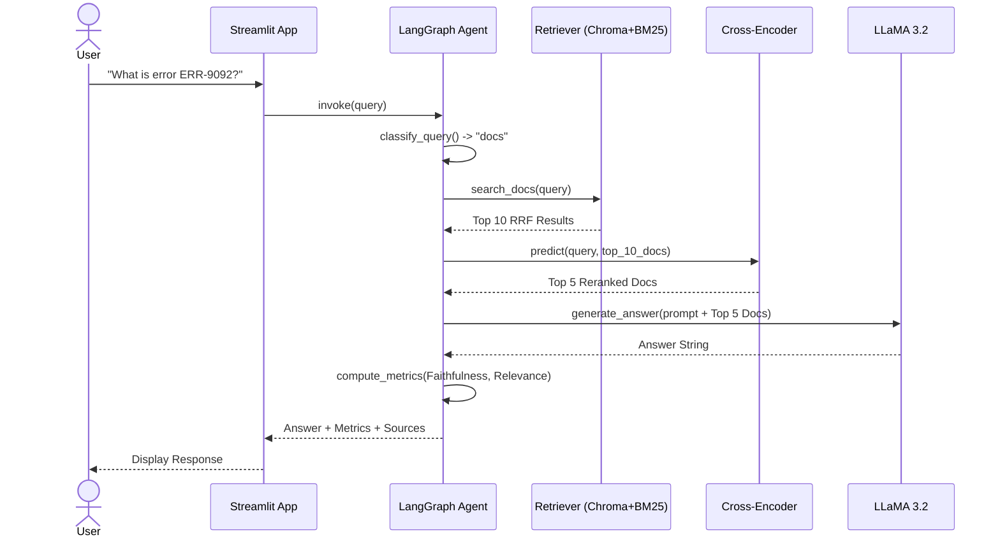
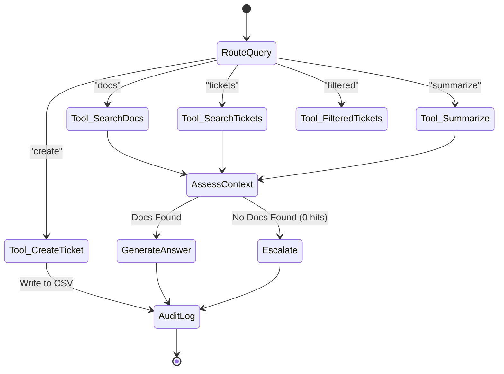

# Enterprise Knowledge Copilot — Architecture & Design Document

This document provides the formal architecture, low-level design, and system diagrams for the Enterprise Knowledge Copilot submission.

---

## 1. Detailed Proposed Solution Architecture & Components

The Enterprise Knowledge Copilot is a modular, privacy-first, 100% local AI system designed to synthesize structured and unstructured enterprise data. 

### Solution Components
1. **Presentation Layer (Streamlit)**: Provides a chat interface, real-time metric dashboards (Confidence, Faithfulness), and reasoning traces.
2. **Orchestration Layer (LangGraph)**: A state-machine agent framework that routes queries, maintains multi-turn conversation memory, and executes specialized tools.
3. **Cognitive Layer (LLaMA 3.2 via Ollama)**: Runs locally to ensure zero data leakage. Synthesizes retrieved context, formulates answers, and structures data for tool execution (e.g., ticket creation).
4. **Retrieval Layer (Hybrid RRF + Cross-Encoder)**: 
   - *Semantic Memory*: ChromaDB (dense vectors via `bge-small-en-v1.5`).
   - *Keyword Memory*: BM25 (sparse vectors).
   - *Relational Memory*: NetworkX Knowledge Graph.
   - *Reranker*: `ms-marco-MiniLM-L-6-v2` cross-encoder for absolute top-k precision.
5. **Data Layer**: Local file ingestion pipeline with automated PII scrubbing (spaCy NER).

---

## 2. Low Level Design (LLD)

The system is decoupled into four core Python modules:

- **`src/ingest.py`**: Handles ETL. Reads CSV/TXT files, executes the `redact()` function (regex + spaCy NER) to mask PII, applies rolling-window chunking (800 chars, 150 overlap), and builds the three independent indices.
- **`src/retriever.py`**: Exposes query methods (`search_docs`, `search_tickets`, `search_filtered_tickets`). Implements Reciprocal Rank Fusion (RRF) to merge Chroma and BM25 scores, then executes the SentenceTransformer Cross-Encoder for final reranking.
- **`src/agent.py`**: Defines the `StateTypedDict` (question, entities, documents, answer, metrics). Contains the `classify_query` router and the 6 tool execution nodes. Implements real-time evaluation formulas and the deduplication logic (Cosine Similarity > 0.75 blocks ticket creation).
- **`src/app.py`**: Manages the Streamlit session state, renders the UI, and calls the LangGraph executor.

---

## 3. Data Sources & Data Engineering Steps

### Data Engineering Pipeline
1. **Extraction**: Raw text is parsed from CSV and TXT files.
2. **PII Sanitization**: Regex detects emails and phone numbers. The `en_core_web_sm` spaCy model detects `PERSON` entities. All are replaced with `[REDACTED]` tokens.
3. **Metadata Tagging**: Ticket rows are split. Attributes like `priority`, `status`, and `error_code` are extracted and injected as metadata payloads for ChromaDB filtering.
4. **Chunking**: Unstructured handbooks are chunked using an 800-character window with a 150-character overlap to preserve semantic context across chunk boundaries.
5. **Graph Construction**: Entity pairs (e.g., System → Owner) are extracted and loaded into NetworkX as directed graph edges.
6. **Vectorization**: Chunks are embedded using `BAAI/bge-small-en-v1.5` and committed to ChromaDB.

---

## 4. Data Model (Entity Relationship Diagram)



---

## 5. Data Flow Diagram (DFD)

```mermaid
graph TD
    subgraph Data Engineering (Offline)
        A[Raw Files: CSV/TXT] --> B[PII Redactor]
        B --> C[Chunker & Metadata Tagger]
        C --> D[(ChromaDB)]
        C --> E[(BM25 Index)]
        C --> F[(NetworkX Graph)]
    end

    subgraph Query Execution (Online)
        U[User Query] --> G[LangGraph Router]
        G --> H{Tool Selection}
        H -->|Tool 1: Docs| I[Hybrid Search]
        H -->|Tool 2: Tickets| I
        I --> J[RRF Fusion]
        J --> K[Cross-Encoder Reranker]
        K --> L[Local LLM]
        L --> M[Streamlit UI Output]
    end

    D -.-> I
    E -.-> I
    F -.-> I
```

---

## 6. Sequence Diagram



---

## 7. State Transition Diagram (LangGraph)



---

## 8. List of Data Sources Planned / Used

1. **`nexacorp_handbook.txt`**: Unstructured HR policies, IT guidelines, and software compliance rules.
2. **`nexacorp_vpn_auth_runbook.txt`**: Unstructured IT troubleshooting guides mapped to specific error codes.
3. **`nexacorp_tickets.csv`**: Structured historical incident data (236 rows). Contains ticket IDs, descriptions, resolutions, and priorities.
4. **`nexacorp_org_chart.csv`**: Structured relational data mapping systems to their human owners (e.g., AUTH-GATEWAY → Marcus Thompson).

---

## 9. Other Relevant Project Documents

- **`README.md`**: Executive summary, installation guide, and quick-start instructions.
- **`REPORT.md`**: Deep-dive technical whitepaper explaining mathematical design decisions (RRF constants, chunking overlap rationale, and evaluation benchmarks).
- **`eval/eval_results.json`**: Ground-truth benchmark proof showing `Precision@5: 0.456` and `Recall@5: 0.880`.

---

## 10. Use of Open Source and Libraries

This solution is built entirely on open-source technologies to guarantee zero vendor lock-in and 100% data privacy.

| Library / Tool | Purpose in Architecture |
|----------------|-------------------------|
| **Ollama** | Local LLM runner. Hosts the LLaMA 3.2 (3B) model entirely offline. |
| **LangGraph** | Orchestrates the state machine, managing multi-turn memory and tool routing. |
| **ChromaDB** | Local vector database storing dense embeddings (`bge-small-en-v1.5`). |
| **rank-bm25** | Python implementation of the BM25 algorithm for exact-keyword search. |
| **NetworkX** | Pure Python library used to build and traverse the Knowledge Graph. |
| **spaCy** | Offline NLP library (`en_core_web_sm`) used for Named Entity Recognition (NER) to redact PII. |
| **SentenceTransformers** | Runs the HuggingFace `ms-marco-MiniLM-L-6-v2` cross-encoder for reranking. |
| **Streamlit** | Rapid frontend framework providing the interactive chat UI and health dashboard. |
