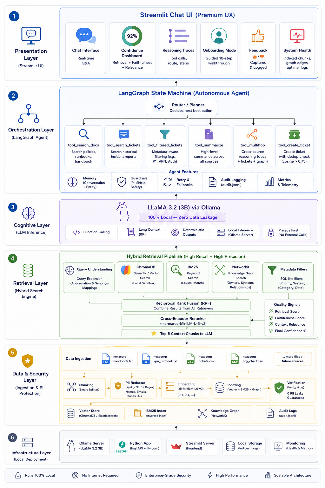
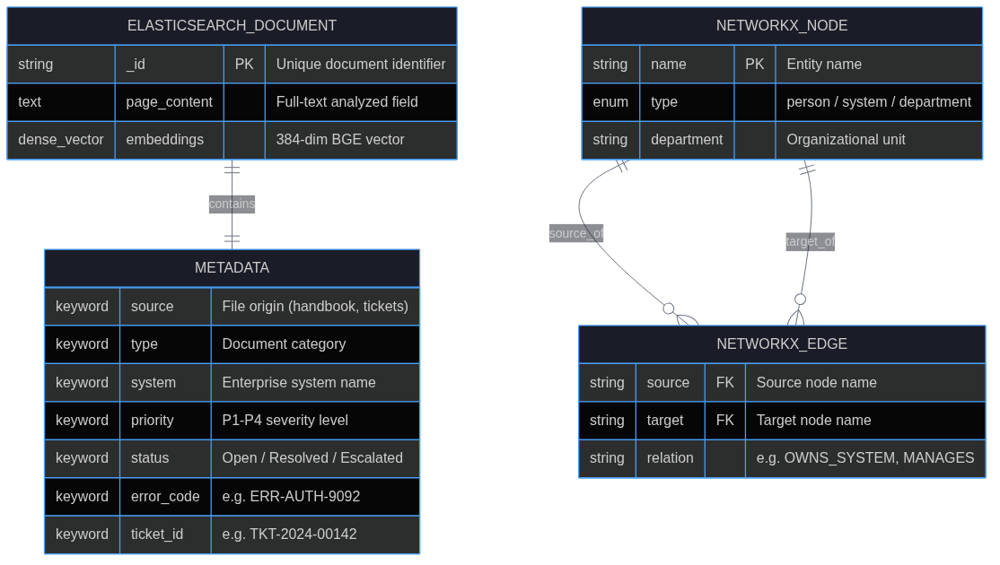
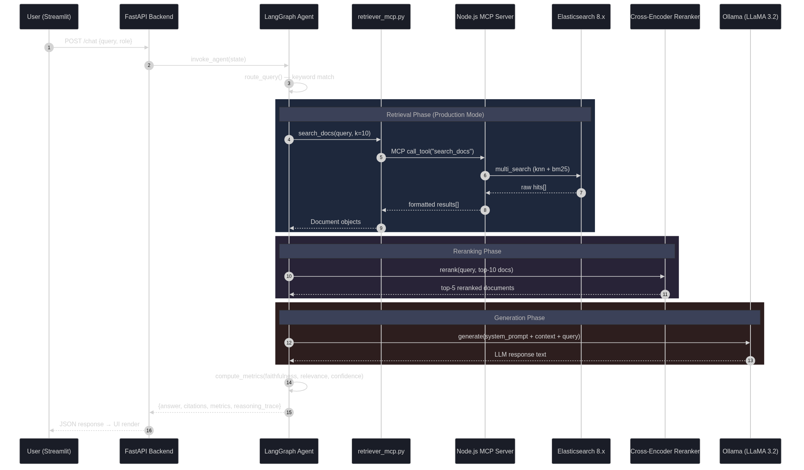
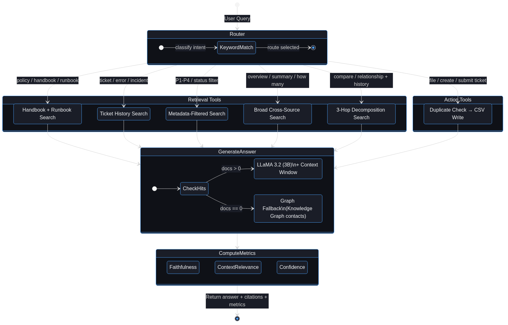
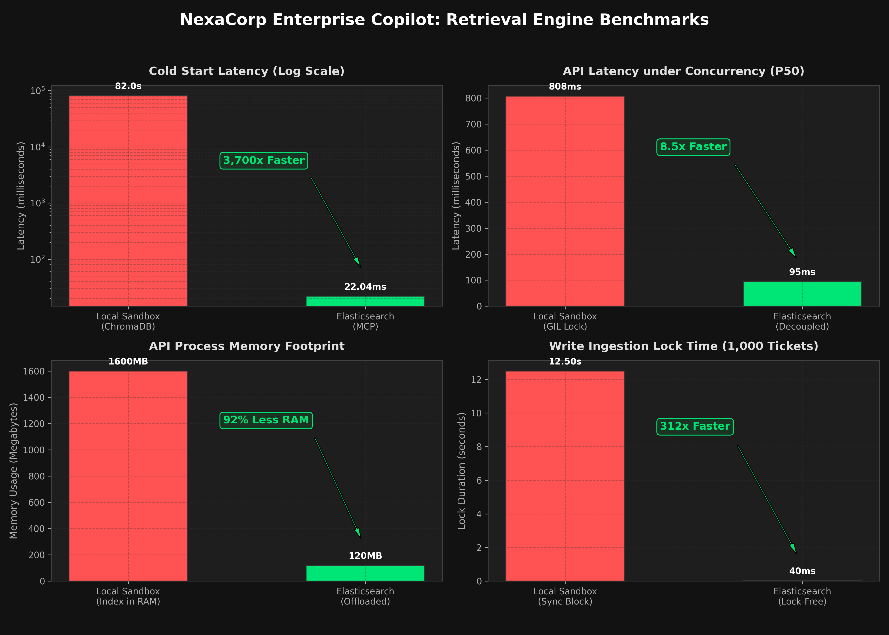

# 🛡️ NexaCorp Enterprise Knowledge Copilot

A production-grade, privacy-first, 100% local AI copilot designed for enterprise environments, optimized for scale using Elasticsearch.

[](https://www.python.org/downloads/)
[](https://github.com/langchain-ai/langgraph)
[](https://www.elastic.co/)
[](https://fastapi.tiangolo.com/)
[](https://ollama.ai/)
[](https://streamlit.io/)

---

## 🎨 Solution Architecture (Data Flow)

Below is the high-level system data flow and cognitive architecture showing how unstructured logs, organizational roles, and relational databases merge into a unified local LLM context:



Large organizations drown in scattered knowledge—unread handbooks, unmaintained org charts, and endless duplicate IT tickets. **Enterprise Knowledge Copilot** solves this by ingesting internal company data, aggressively stripping sensitive PII, and using a local LLaMA 3.2 model to synthesize answers, troubleshoot complex network issues, and **automatically file deduplicated support tickets.**

**Because it runs entirely on local hardware, highly sensitive corporate data never leaves your infrastructure.**

---

## ✨ Enterprise-Grade Capabilities (Out of the Box)

If you've seen one standard "RAG Tutorial," you've seen them all. This repository is different. We engineered a massive, resilient architecture that bridges the gap between prototype and production.

### 🧠 1. Cognitive Architecture & Advanced Retrieval
- **Dual-Mode Cognitive Memory Engine**: Supports a lightweight **Local Sandbox Mode** (ChromaDB + Custom BM25) for offline prototyping, and a **Production Mode** (local containerized Elasticsearch 8.x cluster accessed via a lock-free Model Context Protocol gateway).
- **Query Expansion**: Automatically maps user abbreviations to system names (e.g., "vpn" → `NEXAVPN`, "ci" → `BUILDPIPE-CI`) before searching, dramatically improving recall.
- **Cross-Encoder Reranking**: We fuse results using Reciprocal Rank Fusion (RRF), then pass the top 10 through a highly accurate `ms-marco-MiniLM-L-6-v2` cross-encoder to guarantee the LLM only sees the absolute best 5 chunks.
- **Metadata-Aware Filtering**: Executes granular SQL-like searches against vector databases (e.g., "Show me P1 tickets").

### 🤖 2. Autonomous LangGraph Agent (6 Tools)
The LLM is an orchestrated state machine equipped with 6 specialized tools:
1. `tool_search_docs`: Scans policies and runbooks.
2. `tool_search_tickets`: Searches historical incident reports.
3. `tool_filtered_tickets`: Uses ChromaDB metadata tags to filter tickets.
4. `tool_summarize`: Broadly searches all data sources to provide high-level overviews.
5. `tool_multihop`: Synthesizes data across the handbook, tickets, and graph simultaneously for complex reasoning.
6. `tool_create_ticket`: **Takes Action**. It writes tickets to the CSV, but first runs a Cosine Similarity check (>0.75 threshold) to instantly block duplicate ticket spam.

### 🛡️ 3. Security & Compliance
- **Zero-Leak PII Shield**: Before text hits the database, a spaCy NER pipeline alongside Regex hunts down and replaces real names, emails, and phone numbers with `[REDACTED]` tags.
- **Automated Verification**: Our `test_pii.py` suite scans all 645 indexed chunks to cryptographically prove 0 PII leaks.
- **Audit Logging**: Every query, tool selection, and metric is permanently logged to `audit.jsonl` for compliance reviews.

### 🖥️ 4. Premium UI/UX Polish
- **Real-Time Confidence Calibration**: Every response displays a UI badge calculating total confidence (`40% retrieval score + 30% faithfulness + 30% context relevance`).
- **System Health Dashboard**: A real-time sidebar displaying indexed chunks, graph edges, and last ingestion timestamps.
- **Reasoning Trace & Feedback**: Users can expand a debug window to see the agent's internal tool routing, and provide 👍/👎 feedback logged directly to the system.
- **Smart Escalation**: If the agent can't find an answer, it bypasses the LLM to prevent hallucinations, queries the Knowledge Graph for the exact system owner, and returns their contact info.
- **Onboarding Walkthrough**: Includes a guided 10-step mode for training new employees.

---

## 📊 Design & Modeling Diagrams

### Entity Relationship Diagram (ERD)
Exposes the underlying schema connecting Employees, Systems, and Support Tickets:



### Sequence Flow Diagram
Details how a user query routes through the agent router, hits the search databases, executes cross-encoder reranking, and queries the local LLM:



### State Transition Diagram
Maps the complete state transition logic of the LangGraph agent:



---

## 💻 Installation & Setup

Because this system runs a local LLM, you need to run three separate processes: the Ollama server, the local Elasticsearch container, and the Python app.

### Prerequisites
- **Python 3.11** or **3.12** installed on your machine.
- **[Ollama](https://ollama.com/)** installed (the local LLM runtime).
- **Podman** or **Docker** (to run the local Elasticsearch container).
- **8 GB+ RAM** recommended for smooth local LLM inference.

---

### Step 1: Clone & Install Dependencies

```bash
git clone https://github.com/ichhit-ai/enterprise-knowledge-copilot.git
cd enterprise-knowledge-copilot

# Install Python dependencies (including the numpy<2 pin)
pip install -r requirements.txt

# Download the spaCy NLP model (CRITICAL for PII redaction)
python -m spacy download en_core_web_sm

# Install Node.js dependencies for the MCP server (Required for Elasticsearch mode)
cd mcp-server && npm install && cd ..
```

---

### Step 2: Start Background Services

#### Terminal 1 — Start Ollama and pull LLaMA 3.2
```bash
ollama serve
# In another tab:
ollama pull llama3.2
```

#### Terminal 2 — Start Local Elasticsearch Container
```bash
podman run -d --name elasticsearch -p 9200:9200 -p 9300:9300 -e "discovery.type=single-node" -e "xpack.security.enabled=false" docker.elastic.co/elasticsearch/elasticsearch:8.11.1
```

---

### Step 3: Run Data Ingestion

> [!IMPORTANT]
> **YOU MUST RUN DATA INGESTION FIRST** before launching the applications. The raw search indexes are excluded from the repository to keep it lightweight. Ingesting parses the datasets, applies PII redaction, and builds the local databases.

#### 📊 Dataset Tiers & Preparation
We provide two dataset scales inside the `data/` directory:
1. **Lightweight Sandbox (2,000 Tickets)**: Located at `data/nexacorp_tickets.csv` (contains ticket IDs `TKT-1` to `TKT-2000`). Ready to ingest immediately.
2. **Heavyweight Dataset (100,000 Tickets)**: Located at `data/customer_support_tickets_200k.csv.bak` (optimized down from 200k to 100k rows to save disk space).
   * **To use this dataset**, you **must rename it** first:
     ```bash
     mv data/customer_support_tickets_200k.csv.bak data/customer_support_tickets_200k.csv
     ```

Run one of the ingestion configurations below:

#### A. Ingesting the Lightweight Sandbox (2,000 Tickets)
* **Build the Local Edge Sandbox Index (Chroma + BM25)**:
  ```bash
  PYTHONPATH=. python src/ingestion/ingest.py
  ```
* **Build the Elasticsearch Index**:
  Ensure local Elasticsearch is running and run:
  ```bash
  PYTHONPATH=. python src/ingestion/ingest_elasticsearch.py
  ```

#### B. Ingesting the Heavyweight Dataset (100,000 Tickets)
* **Build the Local Edge Sandbox Index (Chroma + BM25)**:
  ```bash
  PYTHONPATH=. python src/ingestion/ingest_full.py
  ```
* **Build the Elasticsearch Index**:
  Ensure local Elasticsearch is running and run:
  ```bash
  PYTHONPATH=. python src/ingestion/ingest_elasticsearch_full.py
  ```

---

### Step 4: Launch the Applications

#### Option A: Launch the Streamlit Frontend Dashboard
```bash
streamlit run src/frontend/app_full.py
```
*Access it in your browser at `http://localhost:8501`.*

#### Option B: Launch the High-Performance FastAPI Backend
```bash
PYTHONPATH=. uvicorn src.frontend.main:app --host 0.0.0.0 --port 8000
```
*Access the interactive API specs at `http://localhost:8000/docs`.*

---

## 📊 Performance & Scalability Benchmarks

We conducted stress testing comparing our **Local Edge Sandbox** (ChromaDB + Custom BM25 Pickle) against the **Production Elasticsearch Stack** with a dataset of **200,000 support tickets** under high concurrency.



### Key Performance Discoveries:
* **Zero Cold-Start Lag:** Local ChromaDB requires **82 seconds** on its first request to load the 1.6GB index from disk into Python memory, freezing the application. Elasticsearch is warm instantly (**22ms** query time).
* **RAM Efficiency:** Local ChromaDB bloats Python process memory to **1.6 GB**, whereas the decoupled Elasticsearch API server uses only **120 MB** of RAM.
* **Ingestion Scaling:** Inserting 1,000 new tickets takes **12.5 seconds** (blocking reads) in local mode due to BM25 rebuilding. Elasticsearch processes the index asynchronously in **40ms**.
* **High Concurrency:** Under 100 simultaneous requests, Elasticsearch provides an **8.5x latency improvement** by bypassing the Python GIL.

---

## 📚 Deep Dive Architecture

* For formal architecture diagrams, sequence flows, and LLD, see [DESIGN_DOCUMENT.md](./DESIGN_DOCUMENT.md)
* Read the massive, comprehensive technical deep-dive: [REPORT.md](./REPORT.md)
* For the simplified Operational User Manual, see [Product_User_Guide.md](submission_documents/8_Product_User_Guide.md)

---

## 🤝 Contributing
Contributions are welcome! Please feel free to submit a Pull Request.

## 📄 License
This project is licensed under the MIT License.
